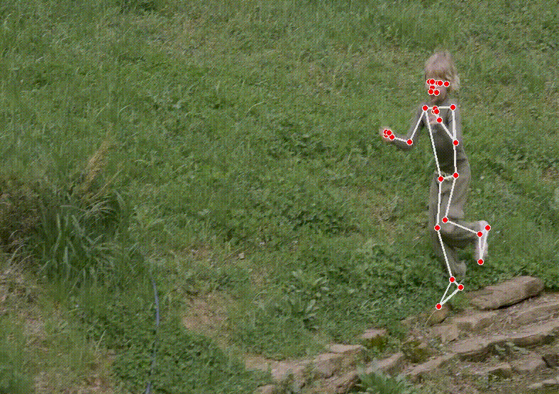
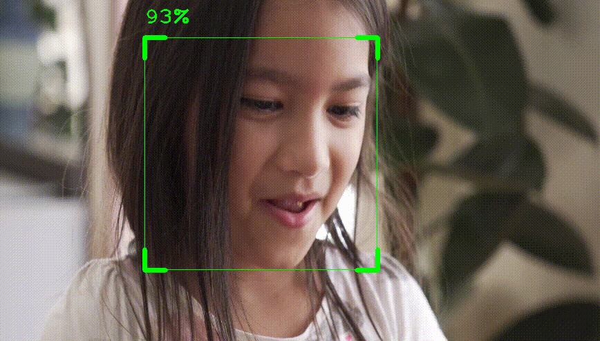
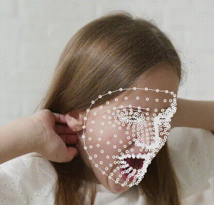

# Detectors World
[](https://pypi.org/project/detectors-world/)
[](https://pepy.tech/project/detectors-world)
[](https://choosealicense.com/licenses/mit/)

Detectors World is a Python package created for building Computer Vision applications in easy and handy way.

Developed by [@MeqdadDev](https://www.github.com/MeqdadDev)


## Available Computer Vision Detectors
The available detectors in Detectors World package are: 
- Hand Detection
- Face Detection
- Pose Detection
- Face Mesh Detection

More detectors will be added in the next releases. Check out contribution guides below.


## Documentation

The complete documentation will be added soon....


## Dependencies

Detectors World dependencies are:

```bash
opencv-python
mediapipe
```

## Installation

Install detectors world package with pip

```bash
pip install detectors_world
```


## Run Detectors 🚀🚀

## Hand Detector ✋

<p align="center">

</p>

Hand detector examples with OpenCV:

#### Example 1:

```python
from detectors_world import DetectorCreator
import cv2 as cv

cap = cv.VideoCapture(0)

creator = DetectorCreator()
hand = creator.getDetector("hand")

while True:
    status, img = cap.read()
    hand.detect(img, drawOnHand=True)
    cv.imshow("Hand Detection", img)
    cv.waitKey(1)
```

#### Example 2:

```python
from detectors_world import DetectorCreator
import cv2 as cv

cap = cv.VideoCapture(0)

creator = DetectorCreator()
hand = creator.getDetector("hand")

while True:
    status, img = cap.read()
    hand.detect(img, drawOnHand=True)
    landmarks = hand.locate(img, drawOnHand=True, handsNumber=1)
    cv.imshow("Hand Detection", img)
    cv.waitKey(1)
```

### Pose Detector 💪

<p align="center">

</p>

Pose detector examples with OpenCV:

#### Example 1:

```python
from detectors_world import DetectorCreator
import cv2 as cv

cap = cv.VideoCapture(0)

creator = DetectorCreator()
pose = creator.getDetector("pose")

while True:
    status, img = cap.read()
    pose.detect(img, drawOnPose=True)
    cv.imshow("Pose Detection", img)
    cv.waitKey(1)
```

### Face Detector 😃

<p align="center">

</p>

Face detector examples with OpenCV:

#### Example 1:

```python
from detectors_world import DetectorCreator
import cv2 as cv

cap = cv.VideoCapture(0)

creator = DetectorCreator()
face = creator.getDetector("face")

while True:
    status, img = cap.read()
    face.detect(img, drawOnFace=True)
    cv.imshow("Face Detection", img)
    cv.waitKey(1)
```

#### Example 2:

```python
from detectors_world import DetectorCreator
import cv2 as cv

cap = cv.VideoCapture(0)

creator = DetectorCreator()
face = creator.getDetector("face")

while True:
    status, img = cap.read()
    face.detect(img, drawOnFace=False)
    landmarks = face.locate(img, drawOnFace=True)
    cv.imshow("Face Detection", img)
    cv.waitKey(1)
```

### Face Mesh Detector 🤖

<p align="center">

</p>

Face mesh detector examples with OpenCV:

#### Example 1:

```python
from detectors_world import DetectorCreator
import cv2 as cv

cap = cv.VideoCapture(0)

creator = DetectorCreator()
facemesh = creator.getDetector("face_mesh")

while True:
    status, img = cap.read()
    facemesh.detect(img, drawOnFace=True)
    cv.imshow("Facemesh Detection", img)
    cv.waitKey(1)
```


## Contributing

Pull requests are welcome. For major changes, please open an issue first to discuss what you would like to change.

For new projects/examples, please make sure you've tested your code in real environment. And to avoid duplications, please take a sneak peek on the uploaded projects before making your PR.

## 🔗 Find me on
[](https://www.linkedin.com/in/meqdad-darwish/)

[](https://twitter.com/MeqdadDev)
